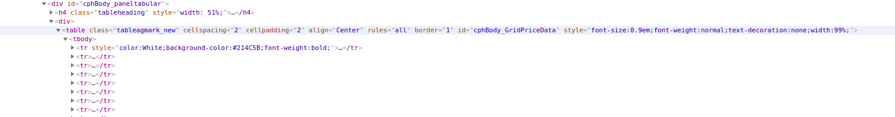
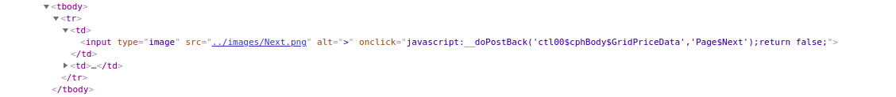

# Crop_in_market

The repo is to extract the data from `agmarknet.gov.in` . The data has been extracted for month 1-Jan-2020 to 30-dec-2020.
The commodity is potato and distict is Agra. The text or content need from the scraping is in table format in HTML , the text from row of the table has extracted using
beatifulSoup. The table has the class name as `tableagmark_new` under the table tag. <br>
<br>
After getting the elements and tags of table i have extracted text from the `<td>` tag from hml.
The data is has 1827 entries and web page are design to show 50 pages so , i have use selenium which uses the webdriver which open the url on the browser and click on the `next` button to
view the next further entries or data. The Webdriver makes the call to the url, and it look for the element path for `input` tag which has the image with name `../image/Next.png`.

<br><br>

After getting the element , it click on it and wait page to load so that text can be extracted using beautifulSoup.
<hr>

## Dependencies:

All the dependies are in req.txt, it can install using:<br>
`pip install -r req.txt`
<br>
<hr>

## How to Run:

Download and install the chrome browser.
Download and save [chrome Webdriver](https://chromedriver.chromium.org/) according to the chrome version and locate them at the sysetm path.
For Unix use the following cmd:

```wget -N http://chromedriver.storage.googleapis.com/2.26/chromedriver_linux64.zip
unzip chromedriver_linux64.zip
chmod +x chromedriver

sudo mv -f chromedriver /usr/local/share/chromedriver
sudo ln -s /usr/local/share/chromedriver /usr/local/bin/chromedriver
sudo ln -s /usr/local/share/chromedriver /usr/bin/chromedriver
```


Download the zip and extract it. One need to have jupyter in his system in order to run the `.ipynb file` , it be get by installing Anaconda or can install [jupyter-lab](https://jupyter.org/install)  

<br>
Further details in processing.doc

